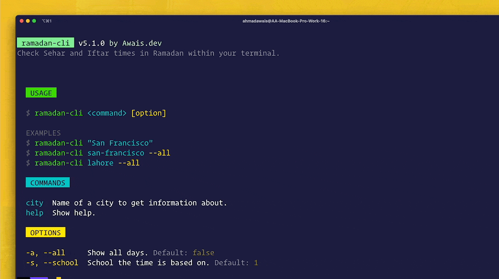

[](https://twitter.com/MrAhmadAwais/)

# ramadan-cli

[](https://www.npmjs.com/package/ramadan-cli) [](https://NodeCLI.com/?utm_source=FOSS) [](https://VSCode.pro/?utm_source=FOSS) [](https://github.com/ahmadawais/sponsor?utm_source=FOSS)
[](https://twitter.com/mrahmadawais/)

> CLI to check Ramadan Sehar and Iftar times in the command line..

<br>

- 🌜 Get Sehar/Iftar times for your city
- 🗓 Get Sehar/Iftar times for entire month of Ramadan
- 🇵🇰 99 cities data including `lahore`, `multan`, `karachi`, `islamabad`, `rawalpindi`, `quetta`, `peshawar`, `hyderabad`,`faisalabad`, `gujranwala`, `sialkot`, `ghotki` and many more

<br>

[](./../../)

## Install

```sh
npx ramadan-cli
```

<br>

[](./../../)

## Usage

```sh
# Show today's Sehar/Iftar.
npx ramadan-cli

# Show all days.
npx ramadan-cli lahore
npx ramadan-cli karachi
npx ramadan-cli lahore --all
npx ramadan-cli lahore -a

# For multiword cities.
npx ramadan-cli "dera ghazi khan"
npx ramadan-cli "dera ghazi khan" --all
npx ramadan-cli "dera ghazi khan" -a
```

[](./../../)

<br>

[](changelog.md)

## Changelog

[❯ Read the changelog here →](changelog.md)

<br>

<small>**KEY**: `📦 NEW`, `👌 IMPROVE`, `🐛 FIX`, `📖 DOC`, `🚀 RELEASE`, and `🤖 TEST`

> _I use [Emoji-log](https://github.com/ahmadawais/Emoji-Log), you should try it and simplify your git commits._

</small>

<br>

[](./../../)

## License & Conduct

- MIT © [Ahmad Awais](https://twitter.com/MrAhmadAwais/)
- [Code of Conduct](code-of-conduct.md)

<br>

[](./../../)

## Connect

<div align="left">
    <p><a href="https://github.com/ahmadawais"></a>&nbsp;<small><strong>(follow)</strong> To stay up to date on free & open-source software</small></p>
    <p><a href="https://twitter.com/MrAhmadAwais/"></a>&nbsp;<small><strong>(follow)</strong> To get #OneDevMinute daily hot tips & trolls</small></p>
    <p><a href="https://www.youtube.com/AhmadAwais"></a>&nbsp;<small><strong>(subscribe)</strong> To tech talks & #OneDevMinute videos</small></p>
    <p><a href="https://AhmadAwais.com/"></a>&nbsp;<small><strong>(read)</strong> In-depth & long form technical articles</small></p>
    <p><a href="https://www.linkedin.com/in/MrAhmadAwais/"></a>&nbsp;<small><strong>(connect)</strong> On the LinkedIn profile y'all</small></p>
</div>

<br>

[](https://github.com/AhmadAwais/sponsor)

## Sponsor

Me ([Ahmad Awais](https://twitter.com/mrahmadawais/)) and my incredible wife ([Maedah Batool](https://twitter.com/MaedahBatool/)) are two engineers who fell in love with open source and then with each other. You can read more [about me here](https://ahmadawais.com/about). If you or your company use any of my projects or like what I’m doing, consider backing me. I'm in this for the long run—an open-source developer advocate.

[](https://twitter.com/mrahmadawais/)

### [NodeCLI.com][n] — Learn to build Node.js CLI Automation

> This repository is part of the [NodeCLI.com][n] course.

After building hundreds of developer automation tools used by millions of developers, I share exactly how you can do it yourself with minimum effective effort. Learn to build Node.js & JavaScript-based CLI (Command Line Interface) apps. Automate the grunt work, do more in less time, impress your manager, and help the community.
→ I'm sharing it all in this online video course. [Node CLI Automation
without wasting 1,000 hours][n] →</p>

[][n]

[][n]

[n]: https://NodeCLI.com?utm_source=github&utm_medium=referral&utm_campaign=ahmadawais/cli-meow-help

[](https://github.com/AhmadAwais/sponsor)
